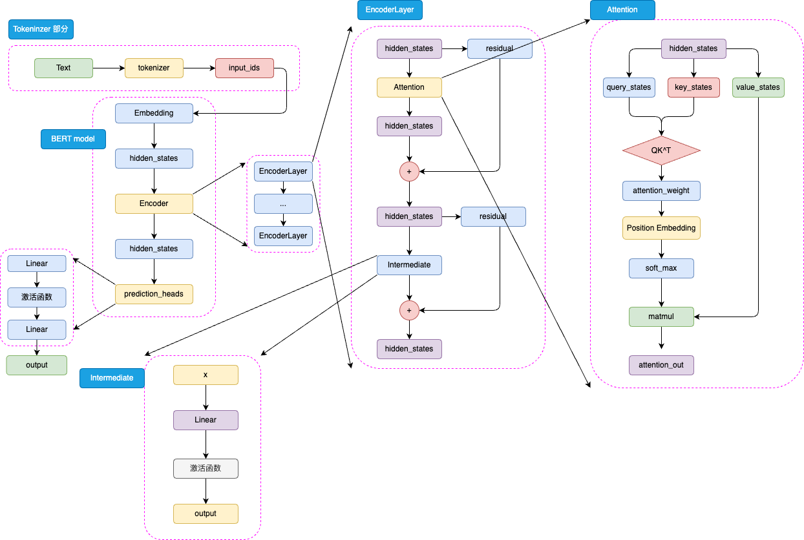
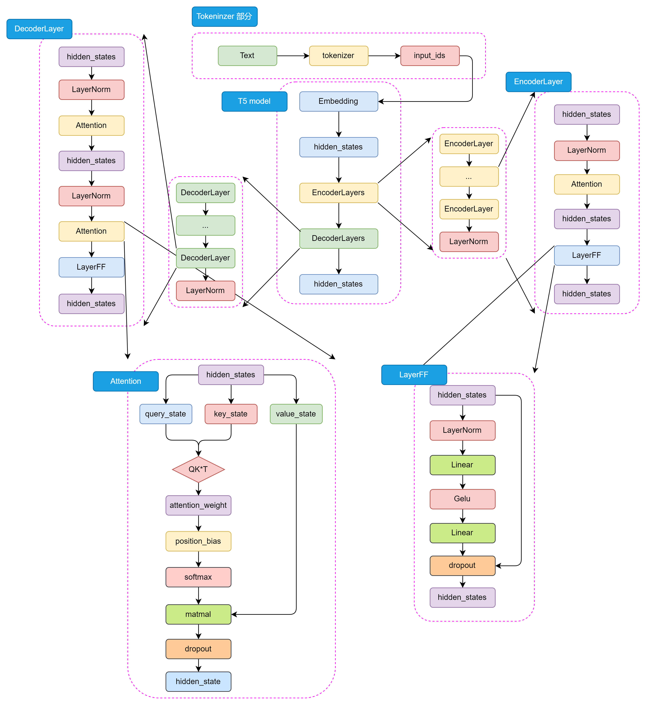
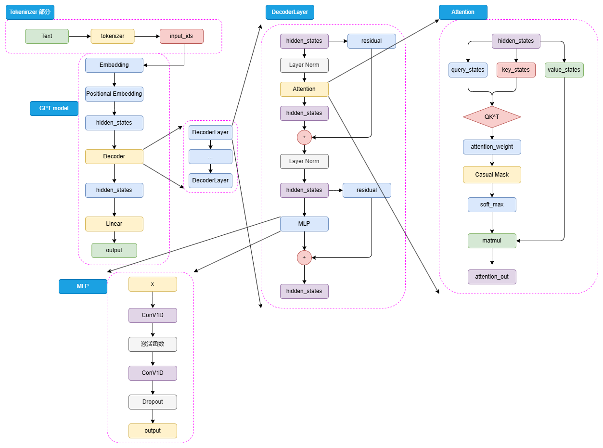

# 预训练语言模型
## Encoder-only PLM
### BERT
全名为 Bidirectional Encoder Representations from Transformers，是针对NLU任务打造的模型，BERT 是一个统一了多种思想的预训练模型。其所沿承的核心思想包括：
* Transformer架构
* 预训练+微调范式

模型整体是由 Embedding、Encoder 加上 prediction_heads 组成

1. 分词方法

BERT 采用 WordPiece 作为分词方法。WordPiece 是一种基于统计的子词切分算法，其核心在于将单词拆解为子词（例如，"playing" -> ["play", "##ing"]）。其合并操作的依据是最大化语言模型的似然度。对于中文等非空格分隔的语言，通常将单个汉字作为原子分词单位（token）处理。

2. 激活函数

BERT 所使用的激活函数是 GELU 函数，全名为高斯误差线性单元激活函数
$$GELU(x)=0.5x(1+tanh(\sqrt{\frac{2}{\pi}})(x+0.044715x^3)$$

3. 位置编码

BERT 将相对位置编码融合在了注意力机制中，将相对位置编码同样视为可训练的权重参数、
### RoBERTa
RoBERTa 的模型架构与 BERT 完全一致，也就是使用了 BERT-large（24层 Encoder Layer，1024 的隐藏层维度，总参数量 340M）的模型参数。
* 提出动机

1. NSP 任务并不能提高模型性能，因为其太过简单，加入到预训练中并不能使下游任务微调时明显受益，甚至会带来负面效果。
2. 十倍于 BERT的预训练数据； 8K 的 batch size（对比 BERT 的 batch size 为 256）下训练31Kstep，在总训练token数一样的3.3B下性能更好，一共训练了500K Step（约合 66个 Epoch）
3. 使用了 BPE 作为 Tokenizer 的编码策略。BPE 编码的词典越大，编码效果越好。由于 Embedding 层就是把 token 从词典空间映射到隐藏空间（也就是说 Embedding 的形状为 (vocab_size, hidden_size)，越大的词表也会带来模型参数的增加。
BERT 原始的 BPE 词表大小为 30K，RoBERTa 选择了 50K 大小的词表来优化模型的编码能力。

### ALBERT
对BERT架构进行优化，主要从减少模型参数角度进行研究
1. 将 Embedding 参数进行分解

BERT-large 具有 24层 Encoder Layer，1024 的隐藏层维度，总共参数量达 340M。而这其中，Embedding 层的参数矩阵维度为 V∗H。从 Word2Vec 的成功经验来看，这种词向量并不需要很大的维度，Word2Vec 仅使用了 100维大小就取得了很好的效果。

    因此ALBERT 设置了 Embedding 层的输出为 128，因此在 Embedding 层后面加入了一个 128∗1024 的线性矩阵来将 Embedding 层的输出再升维到隐藏层大小。也就是说，Embedding 层的参数从 V∗H 降低到了 V∗E+E∗H，当 E 的大小远小于 H 时，该方法对 Embedding 层参数的优化就会很明显。
2. 跨层进行参数共享

BERT 各个 Encoder 层的参数出现高度一致的情况。由于24个 Encoder 层带来了巨大的模型参数，因此，ALBERT 提出，可以让各个 Encoder 层共享模型参数，来减少模型的参数量。

    ALBERT 仅初始化了一个 Encoder 层。在计算过程中，仍然会进行 24次计算，但是每一次计算都是经过这一个 Encoder 层。因此，虽然是 24个 Encoder 计算的模型，但只有一层 Encoder 参数，从而大大降低了模型参数量。在这样的情况下，就可以极大程度地扩大隐藏层维度，实现一个更宽但参数量更小的模型。缺点：虽然 ALBERT 的参数量远小于 BERT，但训练效率却只略微优于 BERT

3. 提出 SOP 预训练任务

不同于 RoBERTa 选择直接去掉 NSP，ALBERT 选择改进 NSP，增加其难度，来优化模型的预训练。

    SOP 任务提出的改进是，正例同样由两个连续句子组成，但负例是将这两个的顺序反过来。也就是说，模型不仅要拟合两个句子之间的关系，更要学习其顺序关系。实验证明，使用 MLM + SOP 预训练的模型效果优于仅使用 MLM 预训练的模型更优于使用 MLM + NSP 预训练的模型。

## Encoder-Decoder PLM
Encoder-only模型存在一些问题，例如 MLM 任务和下游任务微调的不一致性，以及无法处理超过模型训练长度的输入等问题。T5等模型通过引入 Decoder 部分来解决这些问题。
### T5
T5（Text-To-Text Transfer Transformer）是由 Google 提出的一种预训练语言模型，通过将所有 NLP 任务统一表示为文本到文本的转换问题，大大简化了模型设计和任务处理。

和 Encoder 不一样的是，在 Decoder 中还包含了 Encoder-Decoder Attention 结构，用于捕捉输入和输出序列之间的依赖关系，Encoder-Decoder Attention 仅仅在位置编码和 Mask 机制上有所不同，主要是为了区分输入和输出序列

T5 模型的LayerNorm 采用了 RMSNorm，RMSNorm 的参数设置与Layer Normalization 相比更简单，只有一个可学参数，可以更好地适应不同的任务和数据集，公式如下:
$$RMSNorm(x)=\frac{x}{\sqrt{\frac{1}{n}\sum_{i=1}^{n}x_i^2+\epsilon}}*\gamma$$
其中，$\gamma$ 是可学习的缩放参数

#### 预训练任务
T5的预训练任务主要包括以下几个部分：
- 预训练任务: T5模型的预训练任务是 MLM，也称为BERT-style目标。具体来说，就是在输入文本中随机遮蔽15%的token，然后让模型预测这些被遮蔽的token。这个过程不需要标签，可以在大量未标注的文本上进行。
- 输入格式: 预训练时，T5将输入文本转换为"文本到文本"的格式。对于一个给定的文本序列，随机选择一些token进行遮蔽，并用特殊的占位符(token)替换。然后将被遮蔽的token序列作为模型的输出目标。
- 预训练数据集: T5 使用了自己创建的大规模数据集"Colossal Clean Crawled Corpus"(C4)，该数据集从Common Crawl中提取了大量干净的英语文本。C4数据集经过了一定的清洗，去除了无意义的文本、重复文本等。
- 多任务预训练: T5 还尝试了将多个任务混合在一起进行预训练，而不仅仅是单独的MLM任务。这有助于模型学习更通用的语言表示。
- 预训练到微调的转换: 预训练完成后，T5模型会在下游任务上进行微调。微调时，模型在任务特定的数据集上进行训练，并根据任务调整解码策略。

#### 核心理念
大一统思想，把所有NLP任务都统一为文本到文本的任务，对于不同的NLP任务，每次输入前都会加上一个任务描述前缀，明确指定当前任务的类型。

## Decoder-Only PLM
即只使用 Decoder 堆叠而成的模型，目前基本都是Decoder-only模型
### GPT
Generative Pre-Training Language Model，是由 OpenAI 团队于 2018年发布的预训练语言模型。

- 不同于 BERT 选择了可训练的全连接层作为位置编码，GPT 沿用了 Transformer 的经典 Sinusoidal 位置编码，即通过三角函数进行绝对位置编码
- 由于不再有 Encoder 的编码输入，Decoder 层仅保留了一个带掩码的注意力层，并且将 LayerNorm 层从 Transformer 的注意力层之后提到了注意力层之前。
- 对一个输入的 hidden_states，会通过三个参数矩阵来生成 query、key 和 value，而不再是像 Transformer 中的 Decoder 那样由 Encoder 输出作为 key 和 value。
- GPT 的 MLP 层没有选择线性矩阵来进行特征提取，而是选择了两个一维卷积核来提取。

#### 预训练任务——CLM
选择了最传统也最直接的预训练任务——因果语言模型，Casual Language Model，CLM 可以看作 N-gram 语言模型的一个直接扩展，可以在海量无监督语料上直接训练。

#### GPT系列模型
- GPT-1 使用了 12层 Decoder Block 和 768 的隐藏层维度，模型参数量仅有 1.17亿（0.12B）。
- GPT-2 模型结构和 GPT-1 大致相当，只是扩大了模型参数规模、将 Post-Norm 改为了 Pre-Norm（也就是先进行 LayerNorm 计算，再进入注意力层计算）。这些改动的核心原因在于，由于模型层数增加、体量增大，梯度消失和爆炸的风险也不断增加，为了使模型梯度更稳定对上述结构进行了优化。大幅增加了预训练数据集和模型体量。GPT-2 的 Decoder Block 层数达到了48，隐藏层维度达到了 1600，模型整体参数量达 15亿（1.5B）。
- GPT-3 增大了模型体量和预训练数据量，整体参数量达 175B，是当之无愧的“大型语言模型”。在模型结构上，基本没有大的改进，只是由于巨大的模型体量使用了稀疏注意力机制来取代传统的注意力机制。在预训练数据上，则是分别从 CC、WebText、维基百科等大型语料集中采样，共采样了 45T、清洗后 570GB 的数据。

在 GPT 系列模型的基础上，通过引入预训练-指令微调-人类反馈强化学习的三阶段训练，OpenAI 发布了跨时代的 ChatGPT

### LLaMA
与GPT系列模型一样，LLaMA模型也是基于Decoder-Only架构的预训练语言模型。

在这个多层感知机层中，模型通过两个全连接层对hidden_states进行进一步的特征提取。第一个全连接层将hidden_states映射到一个中间维度，然后通过激活函数进行非线性变换，增加模型的非线性能力。第二个全连接层则将特征再次映射回原始的hidden_states维度。

### GLM
核心思路是在传统 CLM 预训练任务基础上，加入 MLM 思想，从而构建一个在 NLG 和 NLU 任务上都具有良好表现的统一模型。
#### 模型架构修正
与GPT仅有三点细微差异：
1. 使用 Post Norm 而非 Pre Norm。Post Norm 由于在残差之后做归一化，对参数正则化的效果更强，进而模型的鲁棒性也会更好；Pre Norm相对于因为有一部分参数直接加在了后面，不需要对这部分参数进行正则化，正好可以防止模型的梯度爆炸或者梯度消失。因此，对于更大体量的模型来说，一般认为 Pre Norm 效果会更好。但 GLM 论文提出，使用 Post Norm 可以避免 LLM 的数值错误（虽然主流 LLM 仍然使用了 Pre Norm）；
2. 使用单个线性层实现最终 token 的预测，而不是使用 MLP；这样的结构更加简单也更加鲁棒，即减少了最终输出的参数量，将更大的参数量放在了模型本身；
3. 激活函数从 ReLU 换成了 GeLUs。ReLU 是传统的激活函数，其核心计算逻辑为去除小于 0的传播，保留大于 0的传播；GeLUs 核心是对接近于 0的正向传播，做了一个非线性映射，保证了激活函数后的非线性输出，具有一定的连续性。

#### 预训练任务
提出的 GLM（General Language Model，通用语言模型）任务，GLM 是一种结合了自编码思想和自回归思想的预训练方法。所谓自编码思想，其实也就是 MLM 的任务学习思路，在输入文本中随机删除连续的 tokens，要求模型学习被删除的 tokens；所谓自回归思想，其实就是传统的 CLM 任务学习思路，也就是要求模型按顺序重建连续 tokens。

其核心思想是，对于一个输入序列，会类似于 MLM 一样进行随机的掩码，但遮蔽的不是和 MLM 一样的单个 token，而是每次遮蔽一连串 token；模型在学习时，既需要使用遮蔽部分的上下文预测遮蔽部分，在遮蔽部分内部又需要以 CLM 的方式完成被遮蔽的 tokens 的预测。

注意！迈入 LLM 时代后，针对于超大规模、体量的预训练，CLM 展现出远超 MLM 的优势。通过将模型体量加大、预训练规模扩大，CLM 预训练得到的生成模型在文本理解上也能具有超出 MLM 训练的理解模型的能力，因此，ChatGLM 系列模型也仅在第一代模型使用了 GLM 的预训练思想，从 ChatGLM2 开始，还是回归了传统的 CLM 建模。

后续模型架构基本回归 LLaMA 架构，引入 MQA 的注意力机制，预训练任务也回归经典的 CLM，放弃了 GLM 的失败尝试。